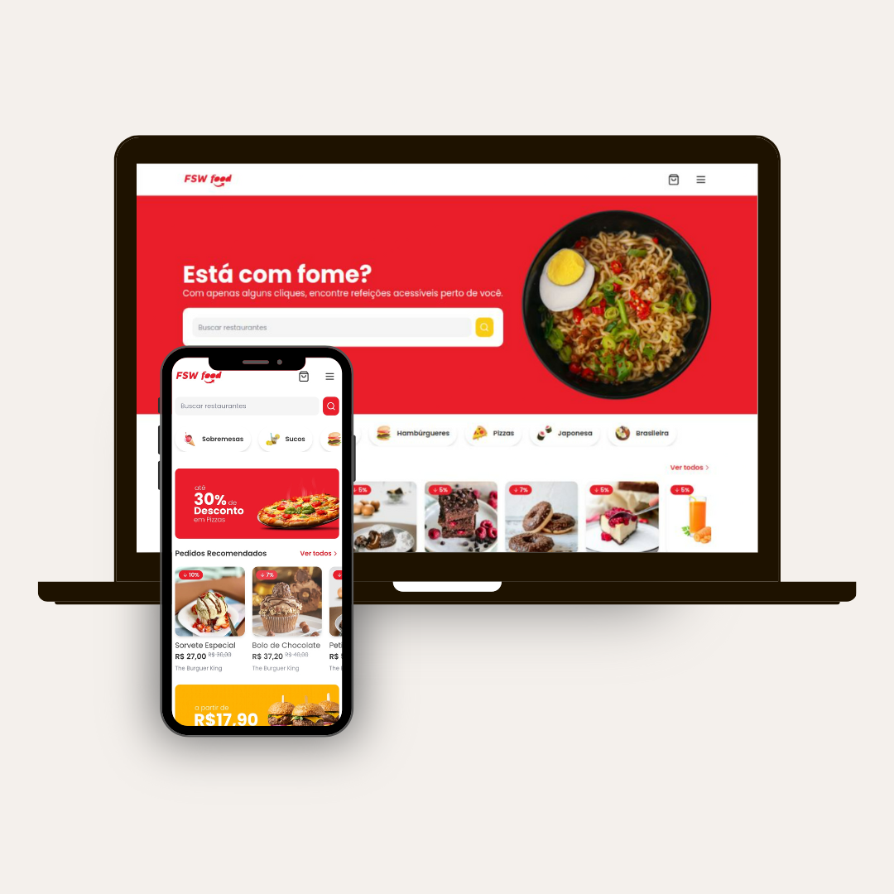

# Sistema de delivery de comida

## 📖 Sobre

Este é um projeto de um sistema de delivery de comida que permite aos usuários fazerem pedidos de comidas em qualquer restaurante disponível no app. Todos os restaurantes, categorias e comidas são pegos do banco de dados Postgres usando Prisma como ORM.

## Funcionalidades
- Cadastro de clientes: os usuários podem realizar login no sistema através de sua conta Google ou Github.

- Carrinho de compras: carrinho de compras acessível em toda a aplicação com Context API.

- Pesquisa de restaurantes: os usuários podem realizar pesquisas a partir do nome do restaurante.

- Favoritar restaurantes: cada usuário pode favoritar e desfavoritar restaurantes, e visualizar seus restaurantes favoritados.

- Visualização de histórico de pedidos: cada usuário pode visualizar o seu histórico de pedidos de maneira individual e refazer qualquer pedido que já esteja concluído.

## Tecnologias utilizadas

## Pré-requisitos
- Next.js (versão 14.2.3)
- Node.js

## Instalação
- Clone o repositório.
- Instale as dependências: npm install
- Configure as env: DATABASE_URL, GOOGLE_CLIENT_ID, GOOGLE_CLIENT_SECRET, GITHUB_ID, GITHUB_SECRET e NEXT_AUTH_SECRET
- Execute o aplicativo: npm run dev

## 🏆 Contribuição
* Sinta-se à vontade para contribuir, reportar problemas ou sugerir melhorias.
* Crie um fork do repositório, faça suas modificações e envie um pull request.